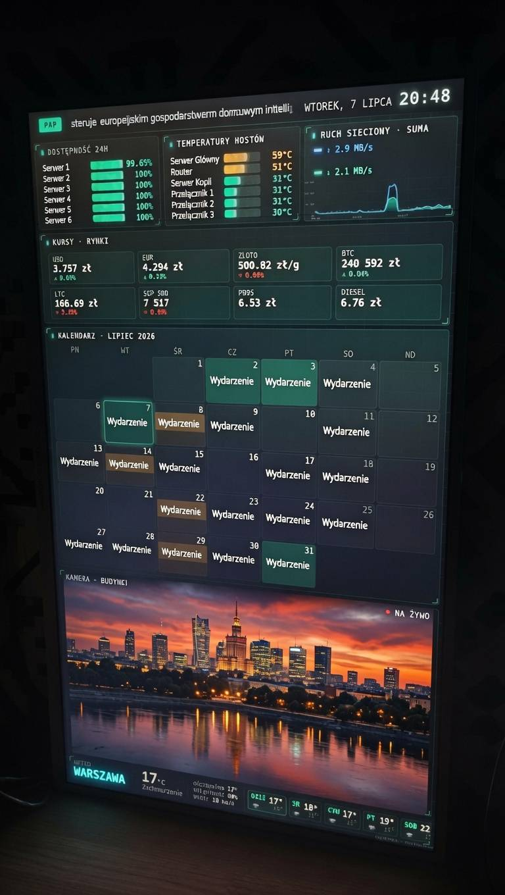

# HOME-LAB · Mission Control

**A single-file kiosk dashboard for a home lab** — one screen showing the health of the
whole infrastructure in real time, plus a few things from everyday life. Zero frameworks,
zero build step, zero dependencies: the entire UI is **one HTML file** with hand-drawn SVG
charts, running full-screen on a dedicated mini-PC.

The aesthetic is deliberately **"22nd-century mission control"** — dark background, mint-teal
accent and a monospace font, colour-matched to [krzysztofgawkowski.pl](https://krzysztofgawkowski.pl).



---

## 🧭 The practical side — what it's for

Instead of logging into several separate panels (host monitoring in one place, service
statuses in another, plus the camera, weather, calendar…), I have **one always-on screen**
that gathers and shows everything by itself. It hangs on the wall on a portrait monitor and
just works — no clicking, no logging in, no maintenance.

At a glance:

- **24 h uptime** of every monitored service (from Uptime Kuma),
- **Host temperatures** with colour thresholds (green → orange → red),
- **Network traffic** — an aggregated up/down chart for the whole home lab,
- **Rates** — USD, EUR, gold, BTC, LTC, S&P 500, fuel prices (95-octane / diesel),
- **Month calendar** with events from a private Google Calendar,
- **Live IP-camera feed** (Hikvision),
- **Weather** for a chosen location + a 5-day forecast,
- **RSS ticker** with headlines (PAP MediaRoom), plus a clock and date.

**Key trait: full automation.** Add a new host in Beszel or a new monitor in Uptime Kuma —
it shows up on the dashboard on its own, without touching the code. Nothing to click, nothing
to restart.

---

## ✨ Features

- 🖥️ **One file, zero dependencies** — runs from `file://`, offline-first, installs nothing.
- 🔁 **Full-auto** — new hosts/monitors are pulled in automatically.
- 🔄 **Entry rotation** — the uptime and temperature panels page through their entries every 10 s (a `1/3`, `2/3`… counter), so any number of items fits.
- 📈 **Hand-drawn SVG charts** — sparklines and area charts with no library at all.
- 📷 **Camera in the browser despite RTSP** — snapshot proxy + `fetch → blob → objectURL` + double-buffering with `img.decode()` (no flicker), with a **LIVE / OFFLINE** label based on link state.
- 🌡️ **Colour thresholds** for temperatures and uptime.
- 🖼️ **Two orientations** — separate files: landscape and portrait, generated from a shared source.
- ⚡ **Optimised for a weak GPU** (Lenovo m625q) — compositor layer isolation, camera scaled to 720p.
- 🎨 **Consistent visual identity** with the author's personal site.

---

## 🏗️ The technical side — how it works

### Architecture

```
┌──────────────────────────────┐        LAN         ┌───────────────────────────┐
│  Mini-PC (kiosk)             │  ───── HTTP ─────▶  │  LXC host / server .7     │
│  Debian + XFCE               │                    │                           │
│  full-screen browser         │  ◀── JSON/JPEG ──   │  micro-proxies (Node.js): │
│  homelab-kiosk-pion.html     │                    │   • cam-proxy   :8899     │
└──────────────────────────────┘                    │   • ical-proxy  :8898     │
        │  direct (CORS OK)                          │   • rss-proxy   :8897     │
        ▼                                            │   • rates-proxy :8896     │
   Beszel :8090  (host metrics)                      └───────────────────────────┘
   Uptime Kuma :3001  (service status)                        │
   Open-Meteo API  (weather)                                  ▼
                                                    Hikvision camera / Google iCal /
                                                    PAP RSS / NBP / CoinGecko / Yahoo
```

The front-end connects **directly** to sources that send CORS headers (Beszel, Uptime Kuma,
Open-Meteo), while anything that doesn't send CORS or needs credentials (camera, calendar,
RSS, rates) goes through a **micro-proxy layer** in Node.js (see [`proxies/`](proxies/)). This
way no credentials ever end up in the HTML file.

### Data sources

| Widget | Source | How it's fetched |
|---|---|---|
| 24 h uptime | Uptime Kuma (SQLite/Express) | direct, read-only account |
| Temperatures / metrics | Beszel (PocketBase) | direct, read-only account |
| Network traffic | Beszel — aggregate of all hosts | computed client-side |
| Weather + forecast | Open-Meteo | direct (public, CORS) |
| Camera | Hikvision ISAPI (digest) | `cam-proxy` → JPEG 720p |
| Calendar | private Google Calendar (iCal) | `ical-proxy` (`RRULE` parser) |
| RSS ticker | PAP MediaRoom | `rss-proxy` |
| Rates | NBP, CoinGecko, Yahoo Finance, fuel prices | `rates-proxy` (averaging + outlier rejection) |

### Rendering and performance

- **Charts** drawn by hand as inline SVG (`path` elements) — no D3/Chart.js etc.
- **Layout** on CSS Grid (`grid-template-areas`); animations only on `transform`/`opacity` (compositor thread).
- **Flicker-free camera** — two `` elements swapped alternately, a new frame shown only after `await img.decode()`.
- **iGPU optimisation** — the camera panel and the ticker header are split onto separate
  compositor layers (`contain` + `translateZ(0)` + `isolation`), so the ~1 Mpix camera texture
  doesn't force the rest of the screen to re-rasterise. The camera is scaled to 720p on the
  Hikvision side.
- **Refresh** — data every 60 s, camera every 1.2 s, clock every 10 s, one "soft" reload per day.

### Stack

`HTML5` · `CSS Grid` · `Vanilla JavaScript (ES6+)` · `SVG` · `Node.js` (proxies) ·
`systemd` · `Beszel` · `Uptime Kuma` · `Open-Meteo` · `Hikvision ISAPI`

---

## 📁 Repo structure

```
.
├── homelab-kiosk-pion.html   # dashboard — PORTRAIT version (vertical monitor)
├── homelab-kiosk.html        # dashboard — LANDSCAPE version
├── proxies/                  # CORS layer (Node.js + systemd, zero dependencies)
│   ├── cam-proxy.cjs         # Hikvision camera (ISAPI, digest) → JPEG 720p
│   ├── ical-proxy.cjs        # Google Calendar (iCal) → JSON, RRULE parser
│   ├── rss-proxy.cjs         # PAP MediaRoom (RSS) → JSON
│   ├── rates-proxy.cjs       # NBP / CoinGecko / Yahoo / fuel → JSON
│   └── README.md             # description of all proxies + a systemd unit example
├── scripts/
│   ├── start-kiosk.sh        # launcher: Chromium --kiosk + screensaver off
│   └── kiosk.desktop         # XFCE/GNOME autostart entry (~/.config/autostart/)
├── docs/
│   └── dashboard.jpg         # photo of the running kiosk
├── LICENSE
└── README.md
```

## 🚀 Getting started

1. Fill in the `CONFIG` block at the top of `homelab-kiosk-pion.html` with your own addresses (the `10.0.0.x` placeholders).
2. Stand up the micro-proxies from [`proxies/`](proxies/) as systemd services.
3. Launch the dashboard in kiosk mode with [`scripts/start-kiosk.sh`](scripts/start-kiosk.sh) (see below).

### Kiosk autostart (XFCE / any Linux with X11)

[`scripts/start-kiosk.sh`](scripts/start-kiosk.sh) launches Chromium in `--kiosk` mode
(full screen, no chrome), turns off the screensaver and DPMS, and keeps a separate browser
profile (no "restore session" bubble after an abrupt shutdown). It auto-detects `chromium`,
`google-chrome` or `brave`.

```bash
# 1. Copy the project to the kiosk machine, e.g. to /opt/kiosk
sudo mkdir -p /opt/kiosk && sudo cp -r . /opt/kiosk && sudo chown -R "$USER" /opt/kiosk

# 2. Test it by hand (Ctrl+C quits)
/opt/kiosk/scripts/start-kiosk.sh                 # portrait version (default)
KIOSK_FILE=/opt/kiosk/homelab-kiosk.html /opt/kiosk/scripts/start-kiosk.sh   # landscape

# 3. Autostart with the XFCE session
mkdir -p ~/.config/autostart
cp /opt/kiosk/scripts/kiosk.desktop ~/.config/autostart/
# set the correct path in the Exec= line of the copied file (defaults to /opt/kiosk/...)
```

After logging back in (or rebooting a machine with autologin) the dashboard starts on its own,
full screen. It's worth enabling **autologin** for the kiosk user in XFCE so that everything
comes back after a power loss without any intervention.

> ⚠️ **Security note:** the `CONFIG` block in this repo contains only example placeholders.
> Don't commit real IP addresses or passwords here — keep credentials only in the proxy files
> on the server.

---

## 👤 Author

**Krzysztof Gawkowski** — [krzysztofgawkowski.pl](https://krzysztofgawkowski.pl) · [github.com/Kr1sCode](https://github.com/Kr1sCode)

## 📄 License

MIT — see [`LICENSE`](LICENSE).
